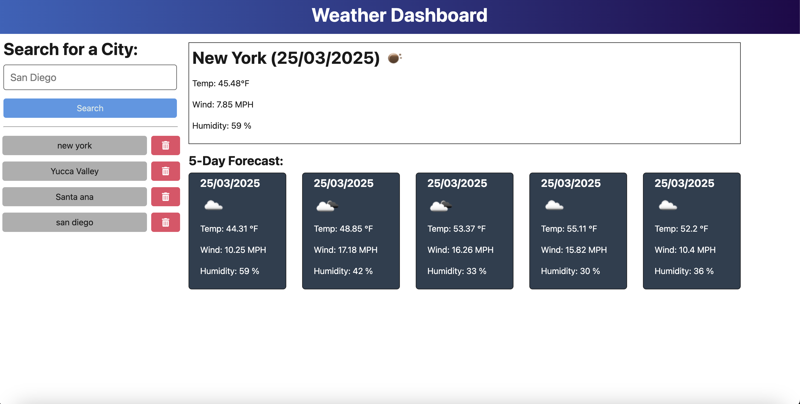

# Weather Dashboard App

A fully responsive web application that provides users with up-to-date weather details for cities worldwide. Users can search for a city's current weather and explore a 5-day forecast. The design ensures optimal viewing and interaction on both mobile and desktop devices.

## Contents

- [Overview](#Overview)
- [Setup Instructions](#Setup-Instructions)
- [How to Use](#How-to-Use)
- [Technologies Used](#technologies-used)
- [License Information](#license-information)
- [Credits & Acknowledgements](#Credits-&-Acknowledgements)

## Overview

This Weather Dashboard offers the following features:
- Search for weather information by city.
- View real-time weather details like temperature, humidity, wind speed, and more.
- Check a 5-day forecast, with detailed weather metrics for each upcoming day.
- Save recent cities searched in a history list for quick access.
- Pulls weather data directly from the OpenWeather API.

### Example Images

<div>
    
</div>

## Setup Instructions

### Clone the Repository

1. First, clone the repository to your local machine:

```bash
   git clone https://github.com/jcalderaro-96/UCI-Module-9-WeatherApp.git
```

2. Then, move into the project directory:

```bash
    cd weather-dashboard-app
```

3. Install all necessary dependencies:

```bash
    npm install
```

This will install the dependencies for both the client and server components of the application.

## How To Use

### Running the App Locally

To start the application on your local machine, use the following command to run both the client and the server:

``` bash
    npm run start:dev
```

This will spin up the development environment for both the frontend (React) and backend (Node.js) servers. The frontend will be available at http://localhost:3000, while the backend server will run on http://localhost:3001.

## Build the Project for Production

To prepare the project for deployment, run:

```bash
    npm run build
```
This command will package the front-end code for production use.

## Deployment

To deploy the app, follow these steps:

1. Push your updates to GitHub.
2. Link your repository to a deployment platform like Render: https://render.com/
3. Set the build command to npm run render-build.
4. Set the start command to npm run start.

### Live App

You can check out the live version of this Weather Dashboard at: <>

## Technologies Used

- Frontend: React.js, Bootstrap, FontAwesome
- Backend: Node.js, Express.js
- Data Storage: In-memory storage for search history
- External API: OpenWeather API for weather data
- Development Tools: TypeScript, npm, nodemon, concurrently, wait-on

## License Information

This project is licensed under the MIT License. For more details, please see the [LICENSE](License) file.

## Credits & Acknowledgments

This application was built upon a codebase originally created by @ThayRibeiro. The core functionality and structure of the app are based on their work. We have refactored and modified the code to ensure compliance and avoid any issues related to code reuse. A huge thank you to ThayRibeiro for the base framework, which made this project possible.

A special thanks to ChatGPT (OpenAI) for assisting with the refactoring, code optimizations, and troubleshooting throughout this process. Jonathan and ChatGPT worked closely together to ensure a working, deployable version of this application, streamlining development and overcoming obstacles efficiently.

